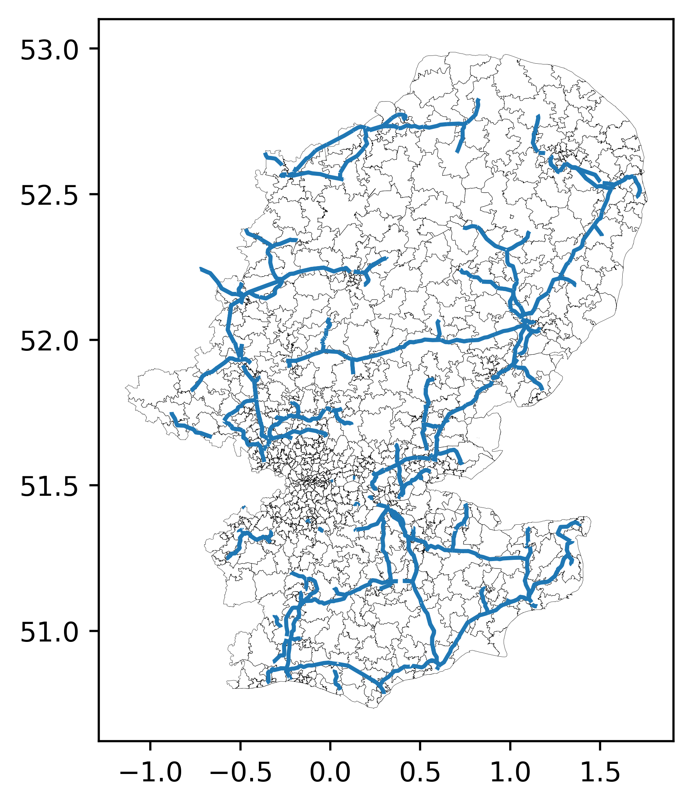
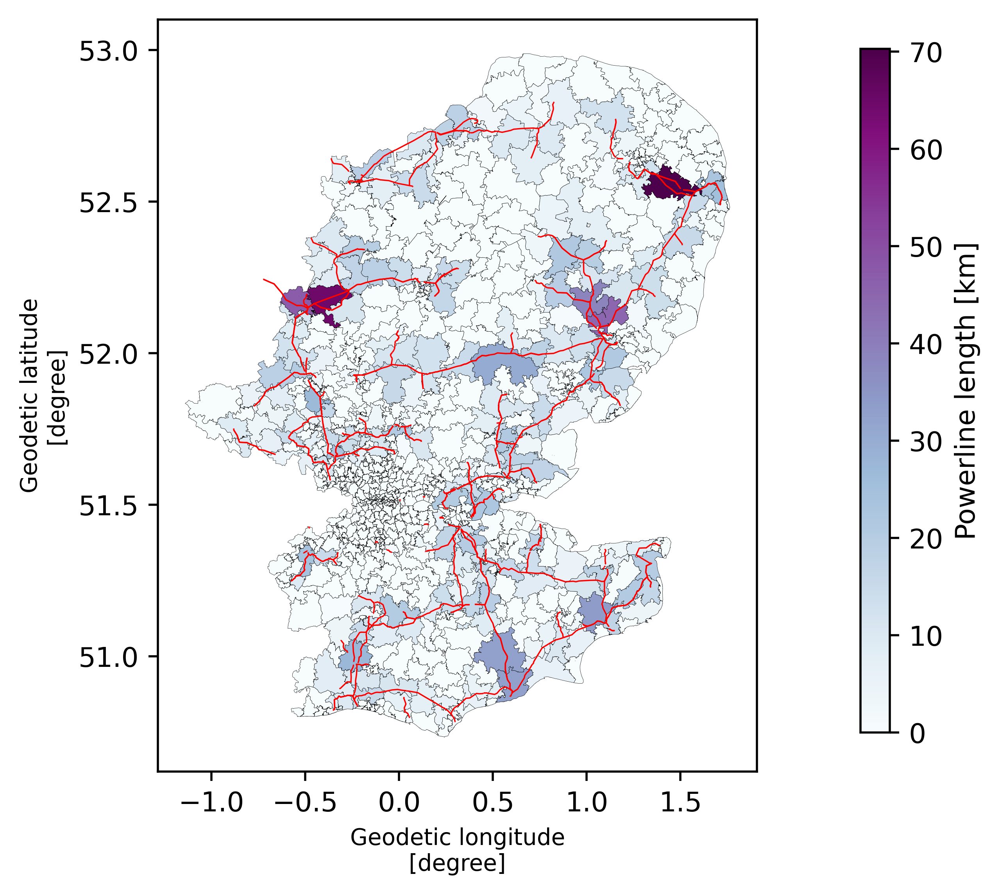
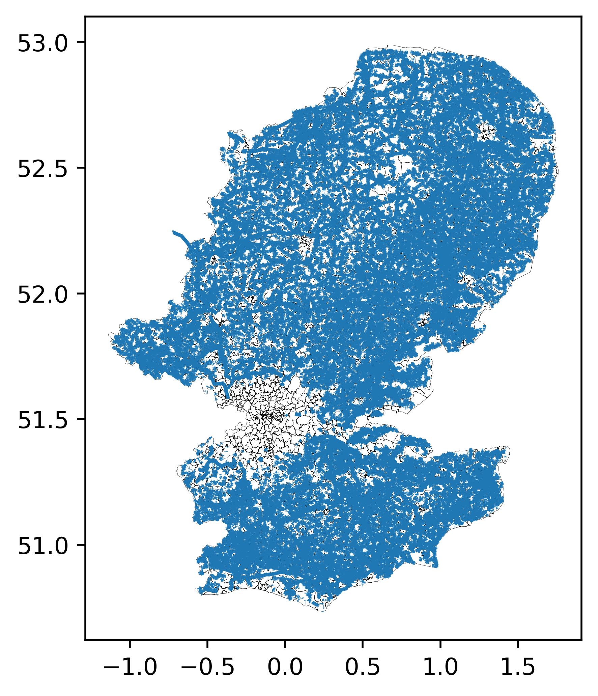
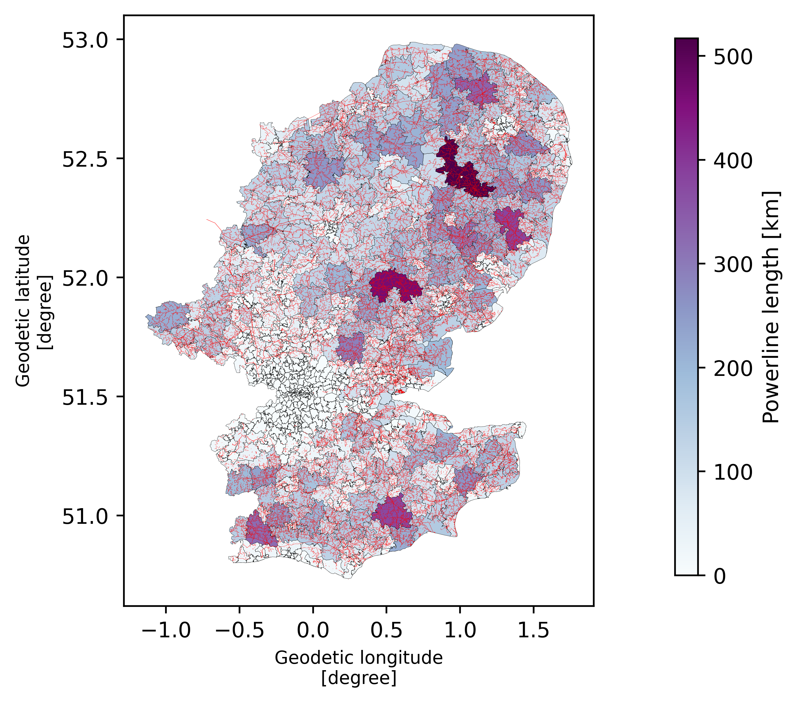

# Power lines in South East England

!!! example "UK Power Networks Open Data"

	This example uses data from the [UK Power Networks open data portal][1].
	The datasets used are:

	- UK Power Networks, Primary Substation Distribution Areas, https://ukpowernetworks.opendatasoft.com/explore/assets/ukpn_primary_postcode_area/, 1 Jun 2026
	- UK Power Networks, UK Power Networks Licence Area 132kV Overhead Lines, https://ukpowernetworks.opendatasoft.com/explore/assets/ukpn-132kv-overhead-lines/, 31 Mar 2026
	- UK Power Networks, UK Power Networks Licence Area 66kV Overhead Lines, https://ukpowernetworks.opendatasoft.com/explore/assets/ukpn-66kv-overhead-lines-shapefile/, 31 Mar 2026
	- UK Power Networks, UK Power Networks Licence Area 33kV Overhead Lines, https://ukpowernetworks.opendatasoft.com/explore/assets/ukpn-33kv-overhead-lines/, 31 Mar 2026
	- UK Power Networks, UK Power Networks Licence Area LV Overhead Lines, https://ukpowernetworks.opendatasoft.com/explore/assets/ukpn-lv-overhead-lines-shapefile/, 30 Mar 2026


The following example shows how to obtain power lines data for the UK
Power Networks DNO, and aggregate it by primary area.  To aggregate
powerline data into areas, we need both the power line data and the
area data.

```python
import geopandas as gpd
import matplotlib.pyplot as plt
import pandas as pd

from pwrd.dnos import UKPNClient

ukpn_client = UKPNClient()
```

```python
ukpn_primary_areas = gpd.read_parquet(ukpn_client["ukpn_primary_postcode_area"].file("parquet")).set_geometry("geo_shape")
power_lines_132kv = gpd.read_parquet(ukpn_client["ukpn-132kv-overhead-lines"].file("parquet")).set_geometry("geo_shape")
# The primary index has some duplicated areas (to be understood)
primary_index = ukpn_primary_areas.set_index("primary")
primary_index = primary_index.loc[~primary_index.index.duplicated(keep="first")]
```

We can plot both of these to see where these power lines are

```python
ax = ukpn_primary_areas.plot(fc="none", lw=0.1)
power_lines_132kv.plot(ax=ax)
```

{ width="75%" }

We can see the 132kV overhead lines. The next question is how we can
aggregate these by area. To do this we can use the
[`line_length_in_areas`][pwrd.PwrdDataFrameAccessor.line_length_in_areas]
method that can be accessed via the
[`pwrd`][pwrd.PwrdDataFrameAccessor] accessor. This operates on the
line data (the power lines) and takes areas as an argument. The areas
must have a named index. The accessor method also needs an explicit
CRS, since not every CRS can be used to compute a meaningful
length. The accessor method returns an `xarray` that is in the right
format to be used with `xvec` for plotting.

```python
_, axes = (
    power_lines_132kv
        .pwrd.line_length_in_areas(primary_index, crs="EPSG:27700")
        .rename("Powerline length [km]")
        .xvec.plot(figsize=(5, 5), cmap="BuPu", ec="k", lw=0.1)
)
power_lines_132kv.plot(ax=axes, color="red", lw=0.5)
```

{ width="100%" }

This looks pretty good. We can see that primary areas that contain
power lines have a darker colour.

## Using all overhead lines

With the UKPN client, it is pretty easy to get all overhead lines and
perform the same analysis. Let's try that.

```python
all_overhead_lines = []
for name, resource in ukpn_client.items():
    if "overhead" not in name:
        continue
    all_overhead_lines.append(gpd.read_parquet(resource.file("parquet")))
    # Check that the length of the loaded parquet file is the same as we expect from the resource
    assert len(resource) == len(all_overhead_lines[-1])
all_overhead_lines = pd.concat(all_overhead_lines).set_geometry("geo_shape")
```

```python
ax = ukpn_primary_areas.plot(fc="none", lw=0.1)
all_overhead_lines.plot(ax=ax)
```

{ width="75%" }

So far more overhead lines when we include more than just the 132kV
lines! Let's try and get the lengths as we did before

```python
_, axes_all = (
    all_overhead_lines
        .pwrd.line_length_in_areas(primary_index, crs="EPSG:27700")
        .rename("Power line length [km]")
        .xvec.plot(figsize=(5, 5), cmap="BuPu", ec="k", lw=0.1)
)
all_overhead_lines.plot(ax=axes_all, color="red", lw=0.1)
```

{ width="100%" }


It takes longer to run (about 40 seconds on an Macbook Pro M1 Pro) but
gives us the power line length for all overhead power lines in the
UKPN area.


[1]: https://ukpowernetworks.opendatasoft.com/pages/home/
