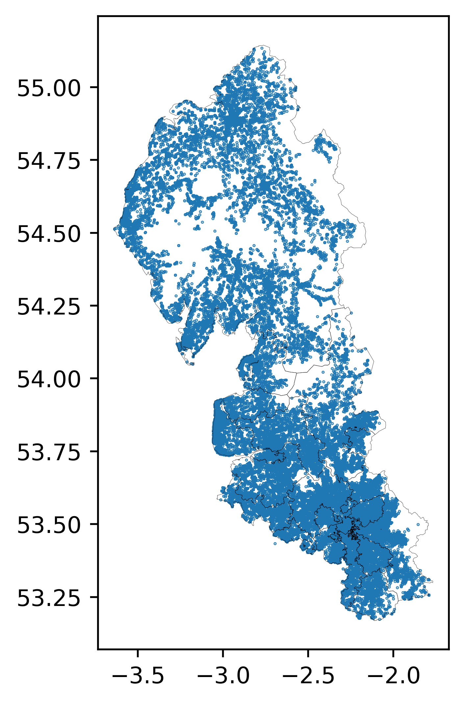
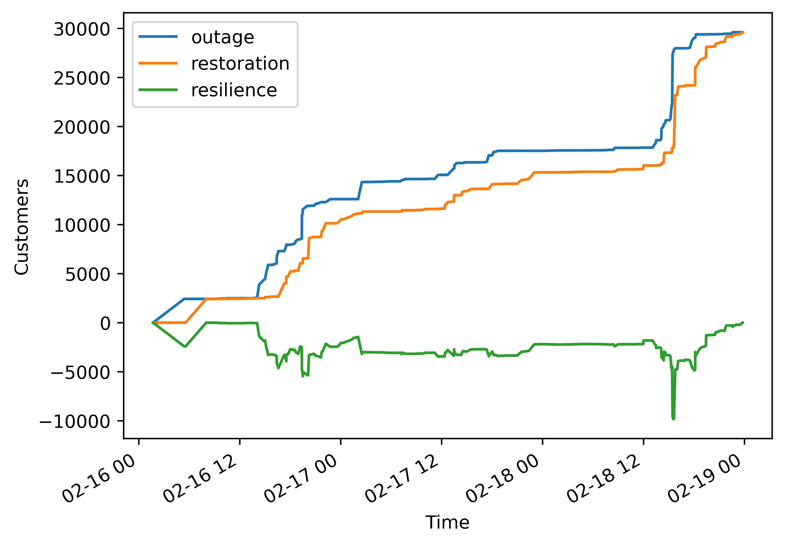

# Unplanned incidents in North West England

## Incident locations

The following example shows the [`ENWClient`][pwrd.dnos.ENWClient] in
action, and other clients work in a similar way. In this example the
grid supply point (GSP) boundaries and a record of unplanned incidents
are obtained from the [Electricity North West open data
portal][enw_open_data]. Incidents are then plotted over the boundaries
of the GSPs using [matplotlib][matplotlib].

```python
import geopandas as gpd
import matplotlib.pyplot as plt

from pwrd.dnos import ENWClient

# Create an instance of the ENWClient
client = ENWClient()

# Download (if they don't exist locally) requested data as 
# parquet files and open them with geopandas
gsps = gpd.read_parquet(
    client["enwl-substation-dso-gsp-polygons"].file("parquet")
).set_geometry("geo_shape")
outages = gpd.read_parquet(client["unplanned-outages"].file("parquet"))

# Create a matplotlib figure and axes
fig, ax = plt.subplots(figsize=(5, 5))

# Plot the outages and gsp boundaries
outages.plot(ax=ax, markersize=0.1, marker='o')
gsps.plot(ax=ax, fc="none", lw=0.1)
```

{ width="66%" }

## Resilience curves

To create resience curves from the unplanned outages data, we need to
supply the column names of the data that contain: 

- The start time of each incident
- The end time of each incident
- The number of customers affected by each incident

We will select only incidents that occurred between the 16th and 18th
of February 2022. These three days saw two [named
storms][metoffice-feb22-named-storms] hit the UK, storms Dudley and
Eunice.


```python
started = outages["incident_date_time"] > "2022-02-16"
ended = outages["restoration_date_time"] < "2022-02-19"

resilience = outages[started & ended].pwrd.resilience(
    start="incident_date_time", 
    end="restoration_date_time", 
    customers="customer_affected"
)
```

By plotting the resilience dataframe we can see when customers
experienced outages. The resilience reaches close to -10,000 on the
18th of February, meaning that almost 10,000 customers were briefly
without power. This was during storm Eunice.

```python
fig, ax = plt.subplots()
resilience.plot(ax=ax)
ax.set(xlabel="Time", ylabel="Customers")

```

{ width = "66%" }


[matplotlib]: https://matplotlib.org
[enw_open_data]: https://electricitynorthwest.opendatasoft.com/pages/homepage/
[metoffice-feb22-named-storms]: https://weather.metoffice.gov.uk/warnings-and-advice/uk-storm-centre/uk-storm-season-2021-22
